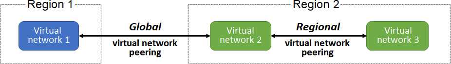
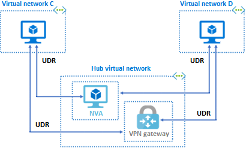
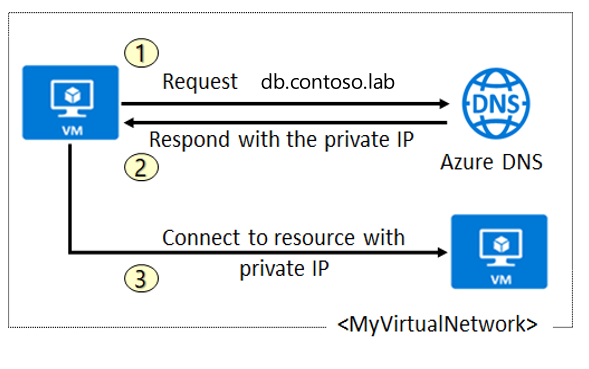
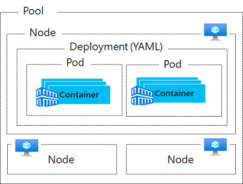

# AZ-104 Study cram

The goal for me was to pass the AZ-104: Microsoft Azure Administrator and i succesfully did ! 🚀👌

- :clipboard: [Microsoft certification page](https://learn.microsoft.com/en-us/certifications/exams/az-104/)

- :clipboard: [AZ-104 evaluation criteria](https://learn.microsoft.com/en-us/certifications/resources/study-guides/az-104)

Here is my exam prep resources.

## Learning resources

### Courses, videos and books

- :memo: [Pluralsight course](https://app.pluralsight.com/paths/certificate/microsoft-azure-administrator-az-104) 
- :memo: [Azure Learning course](https://learn.microsoft.com/en-us/training/paths/az-104-administrator-prerequisites/)
- :film_strip: [AZ-104 Microsoft Azure Administrator Associate Certification SUPER Study Cram on Youtube](https://www.youtube.com/watch?v=VOod_VNgdJk)
- :green_book: [Oreilly: Exam Ref AZ-104 Microsoft Azure Administrator](https://learning.oreilly.com/library/view/exam-ref-az-104/9780136805328/)
- :blue_book: [Oreilly: Exam Ref AZ-104 Microsoft Azure Administrator Certification and Beyond - Second Edition](https://learning.oreilly.com/library/view/exam-ref-az-104/9781801819541/)
- :bookmark_tabs: [Exam Topic AZ-104](https://www.examtopics.com/exams/microsoft/az-104/)

### Exam preps

- :blue_book: [Exam Ref AZ-104 Microsoft Azure Administrator - Chapter 23: Mockup Test Questions and Answers](https://learning.oreilly.com/library/view/exam-ref-az-104/9781801819541/B17467_23_ePub.xhtml#_idParaDest-381)
- [Azure official free prep](https://learn.microsoft.com/certifications/exams/az-104/practice/assessment?assessment-type=practice&assessmentId=21) 
- [Tutorials Dojo](https://portal.tutorialsdojo.com/courses/az-104-microsoft-azure-administrator-practice-exams/?_ga=2.108410626.1012548545.1699282029-1570265640.1693901112&_gl=1*1rv5ym6*_ga*MTU3MDI2NTY0MC4xNjkzOTAxMTEy*_ga_L96TFJ1R9K*MTY5OTI4MjAyOC4xLjEuMTY5OTI4MjA4NS4wLjAuMA..)

## Chapters and useful links

[Change as of 28th of July 2023:](https://learn.microsoft.com/en-us/certifications/resources/study-guides/az-104#change-log)

**Legends:**
- :heavy_check_mark: Mastered
- :x: Not learned/not mastered
- :heavy_plus_sign: Mostly mastered with points to investigate further
- :no_entry: Deleted as of 28th July 2023
- :boom: To update as of 28th July 2023

[Azure chapter](https://learn.microsoft.com/en-us/training/paths/az-104-manage-identities-governance/)

## Port cheat sheet:

|Port|Most common use|
|--|--|
|21|FTP|
|22|SSH|
|53|DNS|
|80|HTTP|
|443|HTTPS (including Sync with Azure AD and Azure resources)|
|445|filesahre|
|3389|RDP|
|5671|Send health information to Azure AD|
|8080|TCP|

## :large_blue_circle: Manage Azure identities and governance (15–20%)
Exam cram complete chapter [Pluralsight](https://app.pluralsight.com/course-player?clipId=f7c83017-e7cc-43e1-8aa2-a9af49ebd12b) (~30min)
### :large_blue_diamond:  Manage Azure AD objects 

- **:heavy_check_mark: Create users and groups**

  - Dynamic groups [Pluralsight](https://app.pluralsight.com/course-player?clipId=afec7468-365a-40e8-8c48-9b8f3021d5af)

  - Powershell user creation [Pluralsight](https://app.pluralsight.com/course-player?clipId=4a445644-741a-485b-bd8f-a2d88d6a0966)

  - Create users [Azure learn](https://learn.microsoft.com/en-us/training/modules/configure-user-group-accounts/2-create-user-accounts?ns-enrollment-type=learningpath&ns-enrollment-id=learn.az-104-manage-identities-governance)

  - Create group accounts (Dynamic user & Dynamic devices) [Azure learn](https://learn.microsoft.com/en-us/training/modules/configure-user-group-accounts/5-create)

- **:heavy_check_mark: Manage licenses in Azure AD**
  
  - AD user types [Pluralsight](https://app.pluralsight.com/course-player?clipId=48a75eb6-e6d5-42c5-b3a3-8dbe8fa2a198)
  
  - Azure AD DS & Azure AD [Azure learn](https://learn.microsoft.com/en-us/training/modules/configure-azure-active-directory/4-compare-active-directory-domain-services)
  
  - Select Azure Active Directory editions [Azure learn](https://learn.microsoft.com/en-us/training/modules/configure-azure-active-directory/5-select-editions) 
  
    

  - Manage multiples AD [Pluralsight](https://app.pluralsight.com/course-player?clipId=1c586986-b485-4e33-be87-d5ab0fefbd1b)

- **:heavy_check_mark: Manage user and group properties**
  
  - Manage users [Azure learn](https://learn.microsoft.com/en-us/training/modules/configure-user-group-accounts/3-manage-user-accounts)
  
- **:heavy_check_mark: Manage guest accounts**
  
- AD B2B [Pluralsight](https://app.pluralsight.com/course-player?clipId=8b69fe91-f001-4e6d-80bc-b06986d3f2ec) [Azure learn](https://learn.microsoft.com/en-us/training/modules/create-users-and-groups-in-azure-active-directory/6-collaborate-guest-accounts-azure-ad-b2b?ns-enrollment-type=learningpath&ns-enrollment-id=learn.az-104-manage-identities-governance) 
  
- **:heavy_check_mark: Configure self-service password reset** (= SSPR)
  
  - Self reset [Azure](https://learn.microsoft.com/en-us/training/modules/allow-users-reset-their-password/2-self-service-password-reset?ns-enrollment-type=learningpath&ns-enrollment-id=learn.az-104-manage-identities-governance), [Doc](https://learn.microsoft.com/en-us/azure/active-directory/authentication/tutorial-enable-sspr) [Youtube](https://www.youtube.com/embed/rA8TvhNcCvQ?azure-portal=true), [Pluralsight](https://app.pluralsight.com/course-player?clipId=da5820e4-743f-475a-87ea-7a47917ffdf2) (_caution with License requirements_)
  - Conditionnal Access [Pluralsight](https://app.pluralsight.com/course-player?clipId=02a0b555-c65d-4989-b976-30176d758f45)

### :large_blue_diamond: Manage access control

- **:heavy_check_mark: Create custom role-based access control (RBAC) and Azure AD roles**

  - Custom roles [Pluralsight](https://app.pluralsight.com/course-player?clipId=a4dca2d8-4852-4b95-9ebf-dbd938c4899d) 

  - Create a role definition [Azure learn](https://learn.microsoft.com/en-us/training/modules/configure-role-based-access-control/3-create-role-definition) *(different type of Actions, NotActions etc.)*

  - Compare Azure roles to Azure Active Directory roles [Azure learn](https://learn.microsoft.com/en-us/training/modules/configure-role-based-access-control/5-compare-azure-roles-to-azure-ad-roles) *(Azure AD role list [Doc](https://learn.microsoft.com/en-us/azure/active-directory/roles/permissions-reference))*

- **:heavy_check_mark: Provide access to Azure resources by assigning roles at different scopes**

  - RBAC overview [Pluralsight](https://app.pluralsight.com/course-player?clipId=be60f7e3-f5f9-4fc7-9c27-8d913fbb8031) [Azure learn](https://learn.microsoft.com/en-us/training/modules/secure-azure-resources-with-rbac/2-rbac-overview) *(Deny assignments & security principals = user, group, app or identity)*

  - Implement RBAC [Azure learn](https://learn.microsoft.com/en-us/training/modules/configure-role-based-access-control/2-implement?ns-enrollment-type=learningpath&ns-enrollment-id=learn.az-104-manage-identities-governance) 

- **:heavy_check_mark: Interpret access assignments**

  - Azure RBAC roles [Doc](https://learn.microsoft.com/en-us/azure/role-based-access-control/built-in-roles)
  - Azure role assignment condition format and syntax [Doc](https://learn.microsoft.com/en-us/azure/role-based-access-control/conditions-format)

### :large_blue_diamond: Manage Azure subscriptions and governance

- **:heavy_plus_sign: Configure and manage Azure Policy**

  - Azure policy overview [Azure learn](https://learn.microsoft.com/en-us/training/modules/configure-azure-policy/3-implement-azure-policies) [Pluralsight](https://app.pluralsight.com/course-player?clipId=12c121ec-fa00-4086-81e6-17f6655621e5) *(Powershell Policies)*

  - Create policies [Azure learn](https://learn.microsoft.com/en-us/training/modules/configure-azure-policy/4-create-azure-policies) [Pluralsight](https://app.pluralsight.com/course-player?clipId=44ff4e64-2112-4bb8-8202-0925ea4e9b0c)

  - Create policy definitions [Azure learn](https://learn.microsoft.com/en-us/training/modules/configure-azure-policy/5-create-policy-definitions)

  - Create an initiative definition [Azure learn](https://learn.microsoft.com/en-us/training/modules/configure-azure-policy/6-create-initiative-definitions) *(Initiatives definition [Doc](https://learn.microsoft.com/en-us/azure/governance/policy/concepts/initiative-definition-structure))*

  - *BONUS: iso-27001 Policy [Doc](https://learn.microsoft.com/en-us/azure/governance/policy/samples/iso-27001)*

- **:heavy_check_mark: Configure resource locks**

  - Locks [Pluralsight](https://app.pluralsight.com/course-player?clipId=85f47438-20cd-4b71-b153-399dd12e5712) *(Powershell + CLI)*

- **:heavy_check_mark: Apply and manage tags on resources**

  - Tags [Pluralsight](https://app.pluralsight.com/course-player?clipId=46cf4e49-1e65-4dd1-bc42-67a94ea1b27a) [Azure learn](https://learn.microsoft.com/en-us/training/modules/configure-subscriptions/7-apply-resource-tagging) 

- **:heavy_check_mark: Manage resource groups**

  - Resource groups [Pluralsight](https://app.pluralsight.com/course-player?clipId=60d0cbf4-8670-4497-b97f-4056bd6cdb8a)

  - Moving resource groups [Pluralsight](https://app.pluralsight.com/course-player?clipId=51c32d80-6d70-42bb-b69d-ff5fb1c32fb3)

- **:heavy_plus_sign: Manage subscriptions**

  - Manage subscriptions [Pluralsight](https://app.pluralsight.com/course-player?clipId=72f2d55d-2019-4d4a-8479-1505b92b53a6) [Azure learn](https://learn.microsoft.com/en-us/training/modules/configure-subscriptions/3-implement-azure-subscriptions) *(you can move resources between subscriptions + you can transfer subscriptions between tenants)*

  - Azure regions [Azure learn](https://learn.microsoft.com/en-us/training/modules/configure-subscriptions/2-identify-regions) *(caution to region pairing and cross-region replication [Doc](https://learn.microsoft.com/en-us/azure/reliability/cross-region-replication-azure))* 

  - Different subscriptions types [Azure learn](https://learn.microsoft.com/en-us/training/modules/configure-subscriptions/4-obtain-subscription) *(Enterprise agreement, Reseller, Partner or Personal)*

- **:heavy_check_mark: Manage costs by using alerts, budgets, and recommendations**

  - Azure cost Management [Pluralsight](https://app.pluralsight.com/course-player?clipId=5a6e75b5-2c34-4a1b-988f-dcbb9961a5b7) [Azure learn](https://learn.microsoft.com/en-us/training/modules/configure-subscriptions/6-implement-cost-management)

  - Azure costs savings [Azure learn](https://learn.microsoft.com/en-us/training/modules/configure-subscriptions/8-apply-cost-savings)

- **:heavy_check_mark: Configure management groups**

  - Management groups overview [Pluralsight](https://app.pluralsight.com/course-player?clipId=9a8ab741-e308-4692-8212-487a73a1a93b)

  - Managemement groups details [Azure learn](https://learn.microsoft.com/en-us/training/modules/configure-azure-policy/2-create-management-groups?ns-enrollment-type=learningpath&ns-enrollment-id=learn.az-104-manage-identities-governance) *(restrictions such as a tree can support up to six levels of depth)*

## :large_blue_circle: Implement and manage storage (15–20%)
### :large_blue_diamond: Configure access to storage

**Notes:** Overview of storages [Azure learn](https://learn.microsoft.com/en-us/training/modules/configure-storage-accounts/2-implement-azure-storage), storage services [Azure learn](https://learn.microsoft.com/en-us/training/modules/configure-storage-accounts/3-explore-azure-storage-services), security strategies [Azure learn](https://learn.microsoft.com/en-us/training/modules/configure-storage-security/2-review-strategies)

- **:heavy_check_mark::boom: Configure Azure Storage firewalls and virtual networks** (Configure network access to storage accounts)

  - Network Access [Pluralsight](https://app.pluralsight.com/course-player?clipId=f1f930c2-d758-4eb1-832a-8d47ef770cc3) & demo [Pluralsight](https://app.pluralsight.com/course-player?clipId=1d524857-49c5-43ab-afb5-8ab889f3cba5)

  - Secure Storage Account Endpoints [Azure learn](https://learn.microsoft.com/en-us/training/modules/configure-storage-accounts/7-secure-storage-endpoints)

- **:heavy_check_mark: Create and configure storage accounts**
  - Azure Storage Accounts [Pluralsight](https://app.pluralsight.com/course-player?clipId=4cdb1023-1bb1-40a9-b5bc-72adc519755c) 

  - Storage accounts types [Azure learn](https://learn.microsoft.com/en-us/training/modules/configure-storage-accounts/4-determine-storage-account-kinds)

  - Access storage [Azure learn](https://learn.microsoft.com/en-us/training/modules/configure-storage-accounts/6-access-storage) *(Custom domains [Doc](https://learn.microsoft.com/en-us/azure/storage/blobs/storage-custom-domain-name?tabs=azure-portal), CDN [Doc](https://learn.microsoft.com/en-us/azure/cdn/cdn-create-a-storage-account-with-cdn))*

  - Storage Account Endpoints [Pluralsight](https://app.pluralsight.com/course-player?clipId=f1b3afdb-5d3b-4e61-bf07-f47a5c34d05a) 

  - Authorizations options [Azure learn](https://learn.microsoft.com/en-us/training/modules/control-access-to-azure-storage-with-sas/2-authorization-options-azure-storage?ns-enrollment-type=learningpath&ns-enrollment-id=learn.az-104-manage-storage)

- **:heavy_check_mark: Generate shared access signature tokens**
  - SAS [Azure learn](https://learn.microsoft.com/en-us/training/modules/configure-storage-security/3-create-shared-access-signatures) [Pluralsight](https://app.pluralsight.com/course-player?clipId=504a0e44-2784-4cd5-b33e-aa338145bed4)

  - URI parameters [Azure learn](https://learn.microsoft.com/en-us/training/modules/configure-storage-security/4-identify-uri-sas-parameters)

- **:heavy_check_mark: Configure stored access policies**

  - Stored access policies [Azure learn](https://learn.microsoft.com/en-us/training/modules/control-access-to-azure-storage-with-sas/5-use-stored-access-policies?ns-enrollment-type=learningpath&ns-enrollment-id=learn.az-104-manage-storage) *(cli, portal, c#)*

  - Stored Access Policy Vs Shared Access Signature [Youtube](https://www.youtube.com/watch?v=lFFYcNbDvdo)

- **:heavy_check_mark: Manage access keys**

  - Demo access keys [Pluralsight](https://app.pluralsight.com/course-player?clipId=9a9496cc-dc7a-4fd5-8959-ecea09aecaf9)

- **:heavy_check_mark: Configure Azure AD authentication for a storage account**
  - Azure AD Authorization [Pluralsight](https://app.pluralsight.com/course-player?clipId=016a05ef-b106-497c-ad4d-da044f1b7979) & demo [Pluralsight](https://app.pluralsight.com/course-player?clipId=7a2b64c3-0953-4704-8337-c27763ce6aef)

- **:heavy_check_mark: Configure storage encryption**

  - Azure Storage encryption [Azure learn](https://learn.microsoft.com/en-us/training/modules/configure-storage-security/5-determine-storage-service-encryption) [Doc](https://learn.microsoft.com/en-us/azure/storage/common/storage-service-encryption)

  - Customer-managed keys (in opposition to Microsoft-managed keys) [Azure learn](https://learn.microsoft.com/en-us/training/modules/configure-storage-security/6-create-customer-managed-keys)

### :large_blue_diamond: Manage data in Azure storage accounts

- **:heavy_check_mark: Create import and export jobs**
  - Azure Import/Export service [Pluralsight](https://app.pluralsight.com/course-player?clipId=1f523fa8-28cd-4545-9265-d91e960b1a91) [Azure learn](https://learn.microsoft.com/en-us/training/modules/configure-storage-tools/3a-use-import-export-service?ns-enrollment-type=learningpath&ns-enrollment-id=learn.az-104-manage-storage)

  - Importing [Pluralsight](https://app.pluralsight.com/course-player?clipId=fcf5ff94-3f1e-49c4-a372-7c230de97cff) and exporting [Pluralsight](https://app.pluralsight.com/course-player?clipId=6e79af87-84d2-41da-bfa2-3e9896625a0c)

  - WAImportExport tool [Pluralsight](https://app.pluralsight.com/course-player?clipId=299628c7-80d3-4c0e-983b-be3db4b955b2) [Azure learn](https://learn.microsoft.com/en-us/training/modules/configure-storage-tools/3b-use-waimportexport-tool)

- **:heavy_check_mark: Manage data by using Azure Storage Explorer and AzCopy**

  - Az storage explorer [Pluralsight](https://app.pluralsight.com/course-player?clipId=a7c01d9c-13ac-4bd6-ac68-351d5e63166f) [Azure learn](https://learn.microsoft.com/en-us/training/modules/configure-storage-tools/2-use-azure-storage-explorer?ns-enrollment-type=learningpath&ns-enrollment-id=learn.az-104-manage-storage)

  - Az copy [Pluralsight](https://app.pluralsight.com/course-player?clipId=31701b15-0613-4dc7-aaf5-18e094a49480) [Azure learn](https://learn.microsoft.com/en-us/training/modules/configure-storage-tools/4-use-azcopy)

- **:heavy_check_mark: Implement Azure Storage redundancy**
  
  - Replication strategies [Azure learn](https://learn.microsoft.com/en-us/training/modules/configure-storage-accounts/5-determine-replication-strategies) [Pluralsight](https://app.pluralsight.com/course-player?clipId=b1d452c1-75dd-4c50-bb2d-a99349b1e591) [Doc](https://learn.microsoft.com/en-us/azure/storage/common/storage-redundancy) *(different tiers)*

  - Primary region [Pluralsight](https://app.pluralsight.com/course-player?clipId=bd312203-9afb-474d-ba94-531cef560c67) [Doc](https://learn.microsoft.com/en-us/azure/storage/common/storage-redundancy#redundancy-in-the-primary-region)

  - Secondary region [Pluralsight](https://app.pluralsight.com/course-player?clipId=4529b7f3-2b8a-46c8-8b16-4b5b01b7f3cd) [Doc](https://learn.microsoft.com/en-us/azure/storage/common/storage-redundancy#redundancy-in-a-secondary-region)
  
    
- **:heavy_plus_sign: Configure object replication**
  
  - Blob object replication [Azure learn](https://learn.microsoft.com/en-us/training/modules/configure-blob-storage/6-determine-blob-object-replication) [Doc](https://learn.microsoft.com/en-us/azure/storage/blobs/object-replication-overview) _(Requires blob versionning)_

### :large_blue_diamond: Configure Azure Files and Azure Blob Storage

- **:heavy_plus_sign: Create an Azure file share**
  - Compare blob and files [Azure learn](https://learn.microsoft.com/en-us/training/modules/configure-azure-files-file-sync/2-compare-files-to-blobs)

  - Manage Azure Files shares [Azure learn](https://learn.microsoft.com/en-us/training/modules/configure-azure-files-file-sync/3-manage-file-shares) *(open port 445)*

  - File Sync overview [Azure learn](https://learn.microsoft.com/en-us/training/modules/configure-azure-files-file-sync/5-implement-file-sync), components [Azure learn](https://learn.microsoft.com/en-us/training/modules/configure-azure-files-file-sync/6-identify-components) and deployment [Azure learn](https://learn.microsoft.com/en-us/training/modules/configure-azure-files-file-sync/7-deploy-azure-file-sync)

- **:heavy_check_mark: Configure Azure Blob Storage**
  - Implement blob storage [Azure learn](https://learn.microsoft.com/en-us/training/modules/configure-blob-storage/2-implement?ns-enrollment-type=learningpath&ns-enrollment-id=learn.az-104-manage-storage)

- **:heavy_check_mark: Configure storage tiers**

  - Performance & access tiers [Pluralsight](https://app.pluralsight.com/course-player?clipId=212c2904-5201-4d53-9b41-736d70614066) *(no conversions of performance after deploy)*

  - Access tiers [Azure learn](https://learn.microsoft.com/en-us/training/modules/configure-blob-storage/4-create-blob-access-tiers) *(recap table)*

- **:heavy_check_mark: Configure blob lifecycle management**

  - Blob lifecycle rules [Azure learn](https://learn.microsoft.com/en-us/training/modules/configure-blob-storage/5-add-blob-lifecycle-management-rules) 

- **:heavy_check_mark::boom: Configure snapshots and soft delete for Azure Files**
  - Snapshots [Azure learn](https://learn.microsoft.com/en-us/training/modules/configure-azure-files-file-sync/4-create-file-share-snapshots)
  -  Enable soft delete on Azure file shares [Doc](https://learn.microsoft.com/en-us/azure/storage/files/storage-files-enable-soft-delete?tabs=azure-portal)

- **:heavy_check_mark::boom: Configure blob versioning**
  - Blob Versioning [Doc](https://learn.microsoft.com/en-us/azure/storage/blobs/versioning-overview)
  - Enable and manage blob versioning [Doc](https://learn.microsoft.com/en-us/azure/storage/blobs/versioning-enable?tabs=portal)

## :large_blue_circle: Deploy and manage Azure compute resources (20–25%)
Exam cram complete chapter [Pluralsight](https://app.pluralsight.com/course-player?clipId=6f2a6657-82a5-4bb2-9868-28ee7bab8bf7) (~20min)

### :large_blue_diamond: Automate deployment of resources by using Azure Resource Manager (ARM) templates or Bicep files (Automate deployment of resources by using templates)

- **:heavy_check_mark::boom: Interpret an ARM template or a Bicep file**

  - Bicep ([Doc](https://learn.microsoft.com/en-us/azure/azure-resource-manager/bicep/overview?tabs=bicep))

- **:heavy_check_mark::boom: Modify an existing Bicep file**

  - [Doc](https://learn.microsoft.com/en-us/azure/azure-resource-manager/bicep/overview?tabs=bicep)

- **:heavy_check_mark: Modify an ARM template**
  - Modify ARM template [Pluralsight](https://app.pluralsight.com/player?course=microsoft-azure-administrator-automate-deployment-configuration-vm&author=michael-teske&name=00d18ab2-22aa-478c-90bd-04fed0374cab&clip=1) & demo [Pluralsight](https://app.pluralsight.com/course-player?clipId=de0ba229-95f5-4871-bce2-edeb7d139760)

- **:heavy_check_mark: Deploy a template**
  - Deploy ARM demo [Pluralsight](https://app.pluralsight.com/course-player?clipId=b3449e77-cf3d-470c-951d-9cee470eb850)

- **:boom: Export a deployment as an ARM template or compile a deployment as a Bicep file** (Save a deployment as an ARM template)
  - Save template [Pluralsight](https://app.pluralsight.com/course-player?clipId=5d76acea-9a22-4354-bde6-56eb4e369b47) *(PowerShell)* & demo [Pluralsight](https://app.pluralsight.com/course-player?clipId=a1470c71-c4d3-4d48-8fe8-acc158dc3f61)

  - Desired State Configuration overview [Azure learn](https://learn.microsoft.com/en-us/training/modules/configure-virtual-machine-extensions/4-implement-desired-state-configuration) 

  - Automation State Configuration [Azure learn](https://learn.microsoft.com/en-us/training/modules/protect-vm-settings-with-dsc/2-what-is-azure-automation-state-configuration?ns-enrollment-type=learningpath&ns-enrollment-id=learn.az-104-manage-compute-resources) [Doc](https://learn.microsoft.com/en-us/powershell/dsc/getting-started/wingettingstarted?view=dsc-1.1) & demo PowerShell [Azure learn](https://learn.microsoft.com/en-us/training/modules/protect-vm-settings-with-dsc/3-use-powershell-dsc?ns-enrollment-type=learningpath&ns-enrollment-id=learn.az-104-manage-compute-resources)

### :large_blue_diamond: Create and configure VMs
- **:heavy_plus_sign: Create a VM**

  - Create and Move VMs [Pluralsight](https://app.pluralsight.com/player?course=microsoft-azure-administrator-create-configure-vm&author=michael-teske&name=eb97f8e9-973d-4835-8ee2-8e3fba49597b&clip=1) *(Powershell)* & demo [Pluralsight](https://app.pluralsight.com/course-player?clipId=6c276b46-f7a8-4290-b55c-8fb79b0ca427) _(For 99.95% SLA we need at least 2 VM in an availability set)_

     

  - Plan VMs [Azure learn](https://learn.microsoft.com/en-us/training/modules/configure-virtual-machines/3-plan) *(pricing, os, reservations...)*

  - Cloud responsibilities [Azure learn](https://learn.microsoft.com/en-us/training/modules/configure-virtual-machines/2-review-cloud-services-responsibilities?ns-enrollment-type=learningpath&ns-enrollment-id=learn.az-104-manage-compute-resources)

    

  - Connect to a VM [Azure learn](https://learn.microsoft.com/en-us/training/modules/configure-virtual-machines/7-connect-to?ns-enrollment-type=learningpath&ns-enrollment-id=learn.az-104-manage-compute-resources) *(HTTP port 80, HTTPS port 443, RDP port 3389, SSH port 22)*

  - Use RDP [Azure learn](https://learn.microsoft.com/en-us/training/modules/create-windows-virtual-machine-in-azure/4-connect-to-a-windows-virtual-machine?ns-enrollment-type=learningpath&ns-enrollment-id=learn.az-104-manage-compute-resources)

  - Manage virtual machines with the Azure CLI [Azure learn](https://learn.microsoft.com/en-us/training/modules/manage-virtual-machines-with-azure-cli/) *(complete CLI guide for cram session: commands, sizing ...)*

- **:heavy_check_mark: Configure Azure Disk Encryption**

  - Azure Disk Encryption [Pluralsight](https://app.pluralsight.com/course-player?clipId=589ef1bd-79c3-4a97-b123-59f29bad31d3) *(PowerShell + need keyvault in Vault access policy On)*

- **:heavy_check_mark: Move VMs from one resource group to another**

  - See *"Create and Move VMs"* above :arrow_up: _(to move resources you can not move the resource without associated VNETs resources)_

    

- **:heavy_check_mark: Manage VM sizes**

  - Manage VM size [Azure learn](https://learn.microsoft.com/en-us/training/modules/configure-virtual-machines/4-determine-virtual-machine-sizing?ns-enrollment-type=learningpath&ns-enrollment-id=learn.az-104-manage-compute-resources) & demo [Pluralsight](https://app.pluralsight.com/course-player?clipId=8018b38f-182a-4b5a-82fb-2d3fcc51a761)

    

- **:heavy_check_mark: Add data disks**

  - VM storages types [Azure learn](https://learn.microsoft.com/en-us/training/modules/configure-virtual-machines/5-determine-virtual-machine-storage?ns-enrollment-type=learningpath&ns-enrollment-id=learn.az-104-manage-compute-resources) *(Temporary  + Data)*
  - Attach data disks [Pluralsight](https://app.pluralsight.com/course-player?clipId=cf8f344d-9b2f-49b7-a1ce-96c68aeb2fa2) & demo [Pluralsight](https://app.pluralsight.com/course-player?clipId=770cea5f-7e87-4c65-b3c2-643c7a094877)

- **:heavy_check_mark: Configure VM network settings**

  - Configure VM Networking [Pluralsight](https://app.pluralsight.com/course-player?clipId=7f89b9d8-f147-4d7b-9197-439ea1e4c747) & demo [Pluralsight](https://app.pluralsight.com/course-player?clipId=74b348a3-92d2-4780-a803-692aaa1ad82f)

- **:heavy_check_mark: Configure VM availability options**

  - Availability Zones [Pluralsight](https://app.pluralsight.com/course-player?clipId=a6c9d1c7-4224-4148-a52e-fb5b54b68f6e) [Azure learn](https://learn.microsoft.com/en-us/training/modules/configure-virtual-machine-availability/5-review-availability-zones) *(99.99% SLAs if 2 VMs -> in the same region but different zones)*

  - Update _(software)_ & Fault _(hardware)_ domains [Pluralsight](https://app.pluralsight.com/course-player?clipId=38ece3a8-d397-4c99-902c-e9bcc37c1fb4) [Azure learn](https://learn.microsoft.com/en-us/training/modules/configure-virtual-machine-availability/4-review-update-fault-domains)

  - Availability sets [Pluralsight](https://app.pluralsight.com/course-player?clipId=9552db09-14c8-4831-939a-6565d6379a31) [Azure learn](https://learn.microsoft.com/en-us/training/modules/configure-virtual-machine-availability/3-setup-availability-sets) *(99.95% SLAs if 2 VMs -> in the same data center)*

    

- **:heavy_check_mark: Deploy and configure VM scale sets**

  - Horizontal _(scale up & down)_ & vertical scaling _(scale in & out)_ [Azure learn](https://learn.microsoft.com/en-us/training/modules/configure-virtual-machine-availability/6-compare-vertical-horizontal-scaling)

  - VM scale sets [Pluralsight](https://app.pluralsight.com/course-player?clipId=ab0dc747-39f8-4361-8a0f-53f9292840ef) [Azure learn](https://learn.microsoft.com/en-us/training/modules/configure-virtual-machine-availability/7-implement-scale-sets) _(horizontal)_

  - Create VM scale set plural [Azure learn](https://learn.microsoft.com/en-us/training/modules/configure-virtual-machine-availability/8-create-scale-sets) 

  - Auto scale [Azure learn](https://learn.microsoft.com/en-us/training/modules/configure-virtual-machine-availability/9-implement-autoscale) & implement [Azure learn](https://learn.microsoft.com/en-us/training/modules/configure-virtual-machine-availability/10-configure-autoscale)

- Create a VM with High Availability and Scalability demo [Pluralsight](https://app.pluralsight.com/course-player?clipId=6f079277-7f2e-48d2-b332-3b6fc4117616)

### :large_blue_diamond: Create and configure containers
- **:heavy_plus_sign::boom: Create and manage an Azure container registry**

  - Create an Azure container registry [Doc](https://learn.microsoft.com/en-us/azure/container-registry/container-registry-get-started-portal?tabs=azure-cli)

- **:heavy_check_mark: Configure sizing and scaling for Azure Container Instances**

  - ACI vs VMs [Pluralsight](https://app.pluralsight.com/course-player?clipId=9cb7e9f5-ab04-4217-8aae-f51986c0dc67) [Azure learn](https://learn.microsoft.com/en-us/training/modules/configure-azure-container-instances/2-compare-containers-to-virtual-machines?ns-enrollment-type=learningpath&ns-enrollment-id=learn.az-104-manage-compute-resources) 

  - ACI [Pluralsight](https://app.pluralsight.com/course-player?clipId=0cfce722-a76b-4f6a-8e97-73a77eb0b84e) *(cli)* [Azure learn](https://learn.microsoft.com/en-us/training/modules/configure-azure-container-instances/3-review) & demo [Pluralsight](https://app.pluralsight.com/course-player?clipId=63bf8087-c590-48ed-bf72-ad73dd85ad80)

  - Docker platform reminders [Azure learn](https://learn.microsoft.com/en-us/training/modules/configure-azure-container-instances/5-review-docker-platform)
    

- **:heavy_check_mark: Create and configure Azure Container Apps**

  - Azure Container App overview [Doc](https://learn.microsoft.com/en-us/azure/container-apps/overview) & [YouTube](https://youtu.be/b3dopSTnSRg?t=188)

### :large_blue_diamond: Create and configure an Azure App Service
- **:heavy_check_mark: Create an App Service plan**

  - Create ASP [Pluralsight](https://app.pluralsight.com/course-player?clipId=c09fd145-29ae-49a4-b34e-5ea9a43e075d) [Azure learn](https://learn.microsoft.com/en-us/training/modules/configure-app-service-plans/2-implement-azure)

    

  - Pricing choices [Azure learn](https://learn.microsoft.com/en-us/training/modules/configure-app-service-plans/3-determine-plan-pricing) [Doc](https://azure.microsoft.com/en-us/pricing/details/app-service/windows/)

- **:heavy_check_mark: Configure scaling settings in an App Service plan**

  - Scale ASP [Pluralsight](https://app.pluralsight.com/course-player?clipId=ceca5f8a-c932-4a5f-b0bb-763aa3691adf) *(Powershell)* [Azure learn](https://learn.microsoft.com/en-us/training/modules/configure-app-service-plans/4-scale-up-scale-out)
  - Auto scale [Azure learn](https://learn.microsoft.com/en-us/training/modules/configure-app-service-plans/5-plan-scaling)

- **:heavy_check_mark: Create an App Service**

  - App Service overview [Pluralsight](https://app.pluralsight.com/course-player?clipId=f05a15a9-0cb2-4570-821e-7963627473a4) [Azure learn](https://learn.microsoft.com/en-us/training/modules/configure-azure-app-services/2-implement)

    

  - Create App Service [Azure learn](https://learn.microsoft.com/en-us/training/modules/configure-azure-app-services/3-create-app-service)

- **:heavy_check_mark: Secure an App Service**

  - Secure App Service [Pluralsight](https://app.pluralsight.com/course-player?clipId=42ba8c47-3ab1-452f-9a85-453b4853b798) [Azure learn](https://learn.microsoft.com/en-us/training/modules/configure-azure-app-services/7-secure-app-service?ns-enrollment-type=learningpath&ns-enrollment-id=learn.az-104-manage-compute-resources)

- **:heavy_check_mark: Configure custom domain names**

  - Configure DNS [Pluralsight](https://app.pluralsight.com/course-player?clipId=059a25ff-040c-41c6-b342-2240bbe27817) [Azure learn](https://learn.microsoft.com/en-us/training/modules/configure-azure-app-services/8-create-custom-domain-names) *(A and CNAME records)*

- **:heavy_plus_sign: Configure backup for an App Service**

  - Backup App [Pluralsight](https://app.pluralsight.com/course-player?clipId=e3a7eb4c-5c9b-4f7c-b303-d76ca85e1c3c) *(until 2:30)* [Azure learn](https://learn.microsoft.com/en-us/training/modules/configure-azure-app-services/9-backup-app-service)

- **:heavy_plus_sign: Configure networking settings**

  - Network App [Pluralsight](https://app.pluralsight.com/course-player?clipId=e3a7eb4c-5c9b-4f7c-b303-d76ca85e1c3c) *(start at 2:30)* 

- Hybrid connection [Doc](https://learn.microsoft.com/en-us/azure/app-service/app-service-hybrid-connections)

- **:heavy_check_mark: Configure deployment settings**

  - Deployment settings [Pluralsight](https://app.pluralsight.com/course-player?clipId=f5af6659-1515-4575-a3d6-56e206349912) & demo [Pluralsight](https://app.pluralsight.com/course-player?clipId=2e4f69a0-d7e6-4cc7-baba-aa8d4ef89b82)
  - Deployment slots create [Azure learn](https://learn.microsoft.com/en-us/training/modules/configure-azure-app-services/5-create-deployment-slots) & add [Azure learn](https://learn.microsoft.com/en-us/training/modules/configure-azure-app-services/6-add-deployment-slots)

## :large_blue_circle: Configure and manage virtual networking (20–25%)
Note: Here is an internal [video from our Azure Architect](https://roquettegroup.sharepoint.com/:v:/s/one-teams-DataScienceTeam/EbbU8LU8yuFFpcG3cBT0SwMBpi5ZCWWaxglUBiE56aFc0g?e=9Hct5B) explaining the current infrastructure we have in terms of VNETs, networks and virtual appliances (Roquette employee only)

### :large_blue_diamond: Configure virtual networks

- **:heavy_check_mark: Create and configure virtual networks and subnets**
  
  - Azure VNET components [Pluralsight](https://app.pluralsight.com/course-player?clipId=a4e81a56-7beb-4022-baf0-a5abc590999b)

  - Azure subnets [Azure learn](https://learn.microsoft.com/en-us/training/modules/configure-virtual-networks/3-create-subnets)

  - Azure Wire Server [Pluralsight](https://app.pluralsight.com/course-player?clipId=a9f46784-a426-4670-84f9-8483c7500d77) (_168.63.129.16_)

  - VNET deployment [Pluralsight](https://app.pluralsight.com/course-player?clipId=cea722ad-407c-4904-a48f-8491d271bdc4) *(with Powershell & CLI)* & demo [Pluralsight](https://app.pluralsight.com/course-player?clipId=146efc24-e81b-44f3-b737-c346f268b48d)

_**Note: in Powerhell we use New to create objects, Add to add object or properties, and Set to validate and deploy**_

  - Subnets delegations [Pluralsight](https://app.pluralsight.com/course-player?clipId=734b0d00-603f-498c-ba25-a6350827e1d1)

  - Name resolution options [Pluralsight](https://app.pluralsight.com/course-player?clipId=c778aee7-f50b-49d1-a195-5a46660b7a1a) 

  - Network Virtual appliance NVA [Pluralsight](https://app.pluralsight.com/course-player?clipId=e78c966b-7c91-4302-8952-806b2ca8cbb9) & [Pluralsight](https://app.pluralsight.com/course-player?clipId=09f3145f-ac4e-4ac8-9955-fcc8e9147676) & [Azure learn](https://learn.microsoft.com/en-us/training/modules/control-network-traffic-flow-with-routes/4-network-virtual-appliances?ns-enrollment-type=learningpath&ns-enrollment-id=learn.az-104-manage-virtual-networks) _(UDR: [Doc](https://learn.microsoft.com/en-us/azure/virtual-network/virtual-networks-udr-overview#user-defined) -> route tables in Roquette subnet for example)_
  
- **:heavy_check_mark: Create and configure virtual network peering**
  
  - VNET peering [Azure learn](https://learn.microsoft.com/en-us/training/modules/integrate-vnets-with-vnet-peering/2-connect-services-using-vnet-peering?ns-enrollment-type=learningpath&ns-enrollment-id=learn.az-104-manage-virtual-networks) [Azure learn](https://learn.microsoft.com/en-us/training/modules/configure-vnet-peering/2-determine-uses) [Pluralsight](https://app.pluralsight.com/course-player?clipId=5eadc68b-37cf-458f-ad53-22c541e49426) *(Note 1: two types Regional and Global | Note 2: Peering must be implemented in both directions to work and there is no transitivity | Note 3: IPs of VNETs peered can not overlap)*
  
    
  
    - :heavy_plus_sign: Gateway transit and connectivity with VPN gateway [Azure learn](https://learn.microsoft.com/en-us/training/modules/configure-vnet-peering/3-determine-gateway-transit-connectivity)
  
      
  
    - Create a VNET peering [Azure learn](https://learn.microsoft.com/en-us/training/modules/configure-vnet-peering/4-create)
  
- **:heavy_check_mark: Configure private and public IP addresses**
  
  - Azure IP addressing [Azure learn](https://learn.microsoft.com/en-us/training/modules/design-ip-addressing-for-azure/2-network-ip-addressing-integration?ns-enrollment-type=learningpath&ns-enrollment-id=learn.az-104-manage-virtual-networks)

  - Public and private IP addresses [Azure learn](https://learn.microsoft.com/en-us/training/modules/design-ip-addressing-for-azure/3-azure-public-private-ip-addressing) [Pluralsight](https://app.pluralsight.com/course-player?clipId=c9b9b986-89d1-433f-9657-05669155bded) _(Public IP addresses => Basic (mainly no availability zones) or Standard (only static IPs) SKUs | Private IP addresses: .1, .2, .3, and last IP addresses are not allowed in each VNET)_

  - Plan IP addresses [Azure learn](https://learn.microsoft.com/en-us/training/modules/configure-virtual-networks/5-plan-addressing)

  - Demo VM IP address [Pluralsight](https://app.pluralsight.com/course-player?clipId=7c1b4f41-96b6-4283-a978-953f3e9d4640) *(Note : we can change the subnet but **not** the vnet after VM creation)*

  - Create public IP address [Azure learn](https://learn.microsoft.com/en-us/training/modules/configure-virtual-networks/6-create-public-ip-addressing) and associate public IP address [Azure learn](https://learn.microsoft.com/en-us/training/modules/configure-virtual-networks/7-associate-public-ip-addresses)

  - Allocate or assign private IP [Azure learn](https://learn.microsoft.com/en-us/training/modules/configure-virtual-networks/8-associate-private-ip-addresses)

  - Routing capabilities of an Azure virtual network [Azure learn](https://learn.microsoft.com/en-us/training/modules/control-network-traffic-flow-with-routes/2-azure-virtual-network-route?ns-enrollment-type=learningpath&ns-enrollment-id=learn.az-104-manage-virtual-networks)
  
- **:heavy_check_mark: Configure user-defined network routes**
  
  - User Defined Routes (UDRs) [Pluralsight](https://app.pluralsight.com/course-player?clipId=384c2f4b-3d18-47f1-ae4d-f3f1cc7651d6) [Azure learn](https://learn.microsoft.com/en-us/training/modules/configure-network-routing-endpoints/3-identify-user-defined-routes) *(Note: by default transitivity does not apply through VNETs & subnets peering => we need an NVA ! We can then use route tables to route from the NVA to other VNETs)* 
  
  - Service endpoints uses [Azure learn](https://learn.microsoft.com/en-us/training/modules/configure-network-routing-endpoints/4-determine-service-endpoint-uses) & services [Azure learn](https://learn.microsoft.com/en-us/training/modules/configure-network-routing-endpoints/5-determine-service-endpoint-services)

  
  - Private link [Azure learn](https://learn.microsoft.com/en-us/training/modules/configure-network-routing-endpoints/6-identify-private-link-uses) _(Works with private endpoints)_
  
    
  
  - Extend VNETs with UDRs [Azure learn](https://learn.microsoft.com/en-us/training/modules/configure-vnet-peering/5-determine-service-chaining-uses)
  
    
  
  - Azure Rounting demo [Pluralsight](https://app.pluralsight.com/course-player?clipId=335d511e-6458-48d4-b3fb-a03fa0239711) **_(Important for UDR)_**
  
- **:heavy_check_mark: Configure Azure DNS**

  - General DNS reminder [Pluralsight](https://app.pluralsight.com/course-player?clipId=68c3bfd2-e14b-4408-a21e-a24f5f926d59)

  - Azure subscription default and custom domains [Azure learn](https://learn.microsoft.com/en-us/training/modules/configure-azure-dns/2-identify-domains-custom-domains)

  - Azure provided name resolution seems to not be on the exam anymore (information to check):

    - Azure provided name resolution [Pluralsight](https://app.pluralsight.com/course-player?clipId=94116658-ba49-48ad-9744-da47f88a20a6) & demo [Pluralsight](https://app.pluralsight.com/course-player?clipId=044cc80f-42be-4a39-ba6b-66a39dc8701b) *(Azure provided name resolution is the default DNS when we do not create specific resources)*
    - Custom DNS settings in provided name [Pluralsight](https://app.pluralsight.com/course-player?clipId=a3d21540-f8c3-48bd-810f-4bd0df5f0bb3) & demo [Pluralsight](https://app.pluralsight.com/course-player?clipId=d71db930-9226-4182-91df-75d823c316f0)

  - Azure DNS service overview [Pluralsight](https://app.pluralsight.com/course-player?clipId=370389f2-ba77-446b-b4ab-895fbe14a2aa)

    
    

  - Azure DNS Public zones [Pluralsight](https://app.pluralsight.com/course-player?clipId=65ce33fc-6775-4137-8534-7ce7b442c7db) [Azure learn](https://learn.microsoft.com/en-us/training/modules/configure-azure-dns/4-create-zones) 

    - Delegate DNS domains [Azure learn](https://learn.microsoft.com/en-us/training/modules/configure-azure-dns/5-delegate-dns-domains)
    - Differences between a DNS record sets and an individual DNS record [Azure learn](https://learn.microsoft.com/en-us/training/modules/configure-azure-dns/5-delegate-dns-domains)
    - Demo create (public) DNS zone [Pluralsight](https://app.pluralsight.com/course-player?clipId=9476ffba-3376-429c-9cfd-403a91898ada) 
    - Demo use (public) DNS zone [Pluralsight](https://app.pluralsight.com/course-player?clipId=5f77d81c-f464-4c62-b2ca-caf3eefc0891)

  - Demo create Azure DNS Private zones [Pluralsight](https://app.pluralsight.com/course-player?clipId=f51ec855-170c-45d0-acec-c14b7e209f7e) [Azure learn](https://learn.microsoft.com/en-us/training/modules/configure-azure-dns/7-plan-for-private-dns-zones)

    - Demo use DNS Private zones [Pluralsight](https://app.pluralsight.com/course-player?clipId=342590c4-83ec-47eb-89b8-1e4aa0b799fd) 

    - Private DNS zones scenarios [Azure learn](https://learn.microsoft.com/en-us/training/modules/configure-azure-dns/8-determine-private-zone-scenarios)

      

  - Bonus: Powershel and CLI for DNS [Pluralsight](https://app.pluralsight.com/course-player?clipId=3f9e09e4-b9ae-4c9b-80c0-37df5ef00a6b) 

### :large_blue_diamond: Configure secure access to virtual networks
- **:heavy_check_mark: Create and configure network security groups (NSGs) and application security groups (ASGs)**

  - NSG [Pluralsight](https://app.pluralsight.com/course-player?clipId=5ac0e1d1-82ee-48ca-899f-f1e724626a63) [Azure learn](https://learn.microsoft.com/en-us/training/modules/configure-network-security-groups/2-implement-network-security-groups)

  - NSG association [Pluralsight](https://app.pluralsight.com/course-player?clipId=2197774a-409c-47c0-b55e-6f4a16270484) *(NSGs can be at resource or subnet level)* & demo [Pluralsight](https://app.pluralsight.com/course-player?clipId=555b3850-5bc5-4b60-8636-f274c945a5e7)

  - Azure Service Tags [Pluralsight](https://app.pluralsight.com/course-player?clipId=e9aa3ea1-cc07-405b-b8fd-fde0d7500839) [Doc](https://learn.microsoft.com/en-us/azure/virtual-network/service-tags-overview) *(In short: Service Tags allow us to set IPs of Azure services and those IPs are updated by Microsoft)*

    

  - ASGs [Azure learn](https://learn.microsoft.com/en-us/training/modules/configure-network-security-groups/6-implement-asgs)

  - Just-in-Time JIT VM access [Pluralsight](https://app.pluralsight.com/course-player?clipId=eb2d4850-2c6b-4ef8-a09b-8eb8060443f6)

- **:heavy_check_mark: Evaluate effective security rules**

  - NSGs rules [Azure learn](https://learn.microsoft.com/en-us/training/modules/configure-network-security-groups/3-determine-network-security-groups-rules) 

    

  - Determine effective rules [Azure learn](https://learn.microsoft.com/en-us/training/modules/configure-network-security-groups/4-determine-network-security-groups-effective-rules) 

    

  - Azure Firewall [Pluralsight](https://app.pluralsight.com/course-player?clipId=3b59afc3-2b10-4bda-8972-12ec48b413a0) [Azure learn](https://learn.microsoft.com/en-us/training/modules/configure-azure-firewall/2-determine-uses?ns-enrollment-type=learningpath&ns-enrollment-id=learn.az-104-manage-virtual-networks) *(Note: Azure NSGs do only IP, port number and protocol and Azure firewall can do more such as DNS)*

    - Create firewall implementation [Azure learn](https://learn.microsoft.com/en-us/training/modules/configure-azure-firewall/3-create-azure-firewalls)

    - Create firewall rules [Azure learn](https://learn.microsoft.com/en-us/training/modules/configure-azure-firewall/4-create-firewall-rules) *(three kind of rules: NAT (for traffic and route IPs), network (IPs ranges), and application (FQDNS => complete domain names))*

    - Demo route table [Pluralsight](https://app.pluralsight.com/course-player?clipId=59a3a544-2cb3-4b3d-a824-0f8ca136001d) 

    - Demo rules [Pluralsight](https://app.pluralsight.com/course-player?clipId=d490161d-400f-40f9-b97b-142ac82244cc)

- **:heavy_check_mark: Implement Azure Bastion**

  - Azure Bastion [Pluralsight](https://app.pluralsight.com/course-player?clipId=b22ef761-2d66-4c38-bc42-f4d6338ac9ce) & demo [Pluralsight](https://app.pluralsight.com/course-player?clipId=c8a9ec1f-32b1-4e0c-903e-2662a5be1439) _(RDP = port 3389 / SSH = port 22 | Azure Bastion needs to be on a dedicated subnet called "AzureBastionSubnet")_

  - Azure Bastion & Azure Firewall [Pluralsight](https://app.pluralsight.com/course-player?clipId=662c81ff-1027-4f4f-b2f5-2d32fce4d29c) 

- **:heavy_check_mark: Configure service endpoints on subnets**

  - Service Enpoints VS Private endpoints [Pluralsight](https://app.pluralsight.com/course-player?clipId=4d03b60b-8c9c-42b0-bd70-17a35f270c29) & demo Service endpoint [Pluralsight](https://app.pluralsight.com/course-player?clipId=20549a36-8bb9-450b-ae3f-917c91064f89) 

- **:heavy_check_mark: Configure private endpoints**

  - Demo Private endpoints [Pluralsight](https://app.pluralsight.com/course-player?clipId=bdb26e36-17b0-45ff-880f-cf34fddd30ee)

### :large_blue_diamond: Configure load balancing
- **:heavy_check_mark: Configure Azure Application Gateway**

  - App gateway overview [Azure learn](https://learn.microsoft.com/en-us/training/modules/configure-azure-application-gateway/2-implement)

  - App Gateway vs Azure Load balancer [Pluralsight](https://app.pluralsight.com/course-player?clipId=9410dc24-712c-4601-a450-397fce42c8c2) _(General case: if we use HTTP or HTTPS, Azure Application Gateway is probably a better option. In any other case, Azure Load Balancer will be used | SSL offload means that the App Gateway handles SSL certificates instead of the backend VMs )_

    
Example of architecture with both + Traffic Manager: _(Note: Azure Front Door is basically an abstraction layer for Traffic Manager + App Gateway together)_

  - App Gateway components [Pluralsight](https://app.pluralsight.com/course-player?clipId=ca082b60-26a4-436f-8409-5b40d107bc18) [Azure learn](https://learn.microsoft.com/en-us/training/modules/configure-azure-application-gateway/4-app-gateway-components) _(note: while the load balancer was limited to VMs in a VNET, App Gateway can redirect to any IP | We can do session affinity | The front end IP can be set behind a DNS to be accessed aswell)_ 

    

  - App Gateway routing [Azure learn](https://learn.microsoft.com/en-us/training/modules/configure-azure-application-gateway/3-determine-routing) *(Path-based (= /image/\* for example) & Multi-site (= multiples sites/DNS routes to the same front end ip and the App Gateway map to a different Backend))*

  - Geographic load balancing [Pluralsight](https://app.pluralsight.com/course-player?clipId=8dc42834-d43c-4eb5-8c4d-4623bead1ad4)

  - Deploy App Gateway demo (Portal) [Pluralsight](https://app.pluralsight.com/course-player?clipId=ab4de002-ab08-495e-ab6d-0be8eec34e0a) & CLI demo [Pluralsight](https://app.pluralsight.com/course-player?clipId=8faa6f94-852a-4ca5-b947-b44f614e6be0)

  - WAF policies demo [Pluralsight](https://app.pluralsight.com/course-player?clipId=c1b174e2-2652-427f-8905-050c1c18e599)

- **:heavy_check_mark: Configure an internal or public load balancer**

  - Load balancer use cases [Pluralsight](https://app.pluralsight.com/course-player?clipId=213b125a-93fe-44a7-ab71-c3bbfbdcd2cc)

  - Azure load balancer [Pluralsight](https://app.pluralsight.com/course-player?clipId=75085a53-4229-4b26-81f0-c14bd44d6b74) [Azure learn](https://learn.microsoft.com/en-us/training/modules/configure-azure-load-balancer/2-determine-uses?ns-enrollment-type=learningpath&ns-enrollment-id=learn.az-104-manage-virtual-networks)

  - Load Balancer capabilities [Azure learn](https://learn.microsoft.com/en-us/training/modules/improve-app-scalability-resiliency-with-load-balancer/2-load-balancer-features?ns-enrollment-type=learningpath&ns-enrollment-id=learn.az-104-manage-virtual-networks)

  - Load balancer SKUs [Pluralsight](https://app.pluralsight.com/course-player?clipId=1a99ddcf-783f-4e42-abed-fe2d1b654f05) [Azure learn](https://learn.microsoft.com/en-us/training/modules/configure-azure-load-balancer/5-determine-skus) _(Note: The Public IP also needs to be Standard in a Standard Scenario | General rules: For the exam the Basic is only used if resources are in an vailability set, any other scenario is Standard)_
   

  - Create back-end pools [Azure learn](https://learn.microsoft.com/en-us/training/modules/configure-azure-load-balancer/6-create-backend-pools)

  - Session affinity [Pluralsight](https://app.pluralsight.com/course-player?clipId=4f36d14e-b82c-4b25-85c7-37e57cca54f3) _(Client IP affinity is often mandatory in the exam if we are making a web application | Floating IP allows direct Server return)_

  - Deployment load balancer [Pluralsight](https://app.pluralsight.com/course-player?clipId=ea826892-a7b4-41e6-a6e6-37fd30c9603c) & demo [Pluralsight](https://app.pluralsight.com/course-player?clipId=a4fccf2a-a3ae-4a8b-8155-3b8db7701320) _(Note: An internal Load balancer will always be bind to a VNET and an internet facing to a public IP)_

  - Create load balancer rules [Azure learn](https://learn.microsoft.com/en-us/training/modules/configure-azure-load-balancer/8-create-load-balancer-rules)

  - Configure load balancer demo [Pluralsight](https://app.pluralsight.com/course-player?clipId=f03278d7-96ea-42c2-b1d2-7688ec776737) & Powershell demo [Pluralsight](https://app.pluralsight.com/course-player?clipId=e9469f00-1357-4010-9c6b-ca78defc507f)

  - Public Load Balancer [Azure learn](https://learn.microsoft.com/en-us/training/modules/improve-app-scalability-resiliency-with-load-balancer/3-public-load-balancer?ns-enrollment-type=learningpath&ns-enrollment-id=learn.az-104-manage-virtual-networks)

  - Internal Load Balancer [Azure learn](https://learn.microsoft.com/en-us/training/modules/improve-app-scalability-resiliency-with-load-balancer/5-internal-load-balancer?ns-enrollment-type=learningpath&ns-enrollment-id=learn.az-104-manage-virtual-networks)

- **:heavy_check_mark: Troubleshoot load balancing**

  - Troubleshooting tools [Pluralsight](https://app.pluralsight.com/course-player?clipId=a8d51393-30ba-422b-ac12-5b975994ac88)
  - Configure diagnostics logs [Pluralsight](https://app.pluralsight.com/course-player?clipId=1ae9d132-0832-4959-8437-9f649f68d3d7)
  - Health probes for Load Balancer [Azure learn](https://learn.microsoft.com/en-us/training/modules/configure-azure-load-balancer/7-create-health-probes)

## :large_blue_circle: Monitor and maintain Azure resources (10–15%)
### :large_blue_diamond: Monitor resources by using Azure Monitor

- **:heavy_check_mark: Configure and interpret metrics**

  - Azure Monitor Datasources [Azure learn](https://learn.microsoft.com/en-us/training/modules/configure-azure-monitor/3-describe-components):

    

  - Logs & metrics target [Pluralsight](https://app.pluralsight.com/course-player?clipId=bf86d79c-1922-448d-9012-234d496dd34a) *(targets = Log Analytics workspace, Event Hub, Storage account ; + example of powershell)*

  - Monitoring data and tiers [Azure learn](https://learn.microsoft.com/en-us/training/modules/configure-azure-monitor/5-identify-data-types)

  - Activity log events [Azure learn](https://learn.microsoft.com/en-us/training/modules/configure-azure-monitor/6-describe-activity-log-events) 

    

  - Metrics and logs [Azure learn](https://learn.microsoft.com/en-us/training/modules/configure-azure-monitor/4-define-metrics-logs)

- **:heavy_check_mark: Configure Azure Monitor Logs** *(= same thing as Azure Log Analytics)*

  - Azure Monitor Logs overview [Pluralsight](https://app.pluralsight.com/course-player?clipId=bef11e5c-8c2a-472c-9262-eb97e06df251) [Azure learn](https://learn.microsoft.com/en-us/training/modules/analyze-infrastructure-with-azure-monitor-logs/2-features-azure-monitor-log?ns-enrollment-type=learningpath&ns-enrollment-id=learn.az-104-monitor-backup-resources)

  - Azure VM agent [Pluralsight](https://app.pluralsight.com/course-player?clipId=139f4ae9-80db-4473-a593-b5377533c869)

  - Demo diagnostics settings [Pluralsight](https://app.pluralsight.com/course-player?clipId=b03a3ac5-dd1e-4e14-a592-71aaaa03c090)

  - Application Insights [Pluralsight](https://app.pluralsight.com/course-player?clipId=7c5d7f31-9988-4001-b7f9-2f13706a1c21) & demo VS code [Pluralsight](https://app.pluralsight.com/course-player?clipId=86e386d5-bc90-4044-b513-274a3d62c2fb) & demo portal [Pluralsight](https://app.pluralsight.com/course-player?clipId=cb6327eb-9d91-4c9a-bf5f-a8a2873330a4)

  - Application Insights Components [Pluralsight](https://app.pluralsight.com/course-player?clipId=1fd38057-7861-4cde-815c-875659efdf56)

- **:heavy_check_mark: Query and analyze logs**

  - Demo Azure monitor [Pluralsight](https://app.pluralsight.com/course-player?clipId=5f2df319-f6e5-47d6-8cef-2796e6ea6b5c)

  - Query activity logs :

    

  - Create basic Azure Monitor log queries [Azure learn](https://learn.microsoft.com/en-us/training/modules/analyze-infrastructure-with-azure-monitor-logs/3-create-log-queries)

  - Azure Monitor Log Searches demo [Pluralsight](https://app.pluralsight.com/course-player?clipId=67efd24b-12b2-43cc-a8c9-7d00c8a849df) *(complete demo)*

- **:heavy_check_mark: Set up alerts and actions**

  - Alerts overview [Pluralsight](https://app.pluralsight.com/course-player?clipId=a7244dff-a365-4436-b47b-507b2739a06d) [Azure learn](https://learn.microsoft.com/en-us/training/modules/configure-azure-alerts/2a-describe-alerts?ns-enrollment-type=learningpath&ns-enrollment-id=learn.az-104-monitor-backup-resources) 
  - Manage monitor alerts [Azure learn](https://learn.microsoft.com/en-us/training/modules/configure-azure-alerts/2b-manage-azure-monitor-alerts) & demo [Pluralsight](https://app.pluralsight.com/course-player?clipId=85aee4e7-c5b1-4246-83eb-7306c0145389)
  - Action groups [Azure learn](https://learn.microsoft.com/en-us/training/modules/configure-azure-alerts/4-create-action-groups)
  - Different alert types [Azure learn](https://learn.microsoft.com/en-us/training/modules/incident-response-with-alerting-on-azure/2-explore-azure-monitor-alert-types) 
    - Performance alerts [Azure learn](https://learn.microsoft.com/en-us/training/modules/incident-response-with-alerting-on-azure/3-metric-alerts)
    - Logs alerts [Azure learn](https://learn.microsoft.com/en-us/training/modules/incident-response-with-alerting-on-azure/5-log-alerts?ns-enrollment-type=learningpath&ns-enrollment-id=learn.az-104-monitor-backup-resources) 
    - Activity log alerts [Azure learn](https://learn.microsoft.com/en-us/training/modules/incident-response-with-alerting-on-azure/6-activity-log-alerts)

- **:heavy_check_mark: Configure monitoring of VMs, storage accounts, and networks by using VM insights**

  - Overview of VM insights [Azure learn](https://learn.microsoft.com/en-us/training/modules/monitor-performance-using-azure-monitor-for-vms/2-what-are-azure-monitor-logs-vms) [Doc](https://learn.microsoft.com/en-us/azure/azure-monitor/vm/vminsights-overview) 

  - Enable the service [Doc](https://learn.microsoft.com/en-us/azure/azure-monitor/vm/vminsights-enable-overview) [Azure learn](https://learn.microsoft.com/en-us/training/modules/monitor-performance-using-azure-monitor-for-vms/3-exercise-set-up-log-analytics-workspace)

### :large_blue_diamond: Implement backup and recovery
- **:heavy_check_mark: Create an Azure Recovery Services vault**

  - Azure RSV [Pluralsight](https://app.pluralsight.com/course-player?clipId=a9e62b70-90ae-4d9b-9487-aefa378a71cd) [Azure learn](https://learn.microsoft.com/en-us/training/modules/configure-file-folder-backups/4-setup-recovery-service-vault-backup-options) & demo [Pluralsight](https://app.pluralsight.com/course-player?clipId=937064ca-2cae-42bd-9985-3c68a5b964fe) *(Note: Azure Backup = same region ; Site recovery = different region + handle AWS and on-premise)*

  - Azure Backup Center [Azure learn](https://learn.microsoft.com/en-us/training/modules/configure-file-folder-backups/3-implement-azure-backup-center) [Doc](https://learn.microsoft.com/en-us/azure/backup/backup-center-overview) _(This is not an Azure Ressource but an aggregate of informations)_
 

- **:heavy_check_mark: Create an Azure Backup vault**

  - Azure Backup Vault [Pluralsight](https://app.pluralsight.com/course-player?clipId=668a42e1-fe21-459d-b03c-42023fa1ef57) 

- **:heavy_check_mark: Create and configure backup policy**

  - Azure Backup policy [Pluralsight](https://app.pluralsight.com/course-player?clipId=85c3c2d5-6aae-49d2-9cf4-b3e62ccfefc9) demo [Pluralsight](https://app.pluralsight.com/course-player?clipId=25d5995f-7f64-4d1a-973f-4c59d465b4c7) *(Note: Azure Backup policy are in both Azure Recovery Services vault and in Azure backup vault)*

    

- **:heavy_check_mark: Perform backup and restore operations by using Azure Backup**

  - Backup options for VMs [Azure learn](https://learn.microsoft.com/en-us/training/modules/configure-virtual-machine-backups/2-protect-data) & create backup VM [Azure Learn](https://learn.microsoft.com/en-us/training/modules/configure-virtual-machine-backups/3-create-snapshots) _(Azure Backup, Azure Site Recovery, Azure managed disks - snapshot, Azure managed disks - image)_

  - Azure VM backup [Pluralsight](https://app.pluralsight.com/course-player?clipId=e79f353d-2ea7-4740-abcc-54c06c92e0a3) [Azure learn](https://learn.microsoft.com/en-us/training/modules/configure-virtual-machine-backups/5-backup-virtual-machines) & demo [Pluralsight](https://app.pluralsight.com/course-player?clipId=ed9cd74d-6b06-4268-a5b3-046d1544b23d) 

  

  - Azure VM Restore options [Pluralsight](https://app.pluralsight.com/course-player?clipId=c3f57a2b-b32c-4dca-8cdf-8352b4dd58e7)

    

  - Azure VM snapshot [Azure learn](https://learn.microsoft.com/en-us/training/modules/configure-virtual-machine-backups/3-create-snapshots)

  - VM restore 
    - Full restore demo [Pluralsight](https://app.pluralsight.com/course-player?clipId=e7e5910c-3ac4-473e-a3f5-ddfd9f6a9fe9)

    - Restore file VM demo [Pluralsight](https://app.pluralsight.com/course-player?clipId=178ed167-36c1-4ee4-94b2-487a33625081)

    - Azure Files Backup [Pluralsight](https://app.pluralsight.com/course-player?clipId=67d3cfe6-78b8-42b4-98a7-ea3a6a6d6732) & demo [Pluralsight](https://app.pluralsight.com/course-player?clipId=d0cdaf39-f368-4477-9e42-4bc6bb81185f)

   - Recover backup with soft delete [Pluralsight](https://app.pluralsight.com/course-player?clipId=03079067-0a02-4b4b-822c-362f24706d1b)

  - Compare the Microsoft Azure Recovery Services (MARS) agent and Azure Backup Server [Azure learn](https://learn.microsoft.com/en-us/training/modules/configure-virtual-machine-backups/8-compare-backup-options) _(The MARS is only for windows and for files and folders)_

    - Microsoft Azure Recovery Services (MARS) agent [Azure learn](https://learn.microsoft.com/en-us/training/modules/configure-file-folder-backups/5-mars-backup-agent) _(this backup to an RSV)_
    - System Center Data Protection Manager [Azure learn](https://learn.microsoft.com/en-us/training/modules/configure-virtual-machine-backups/7-implement-azure-backup-server)

    

    - Configure on-premises file and folder backups [Azure learn](https://learn.microsoft.com/en-us/training/modules/configure-file-folder-backups/6-configure-backups)
    
  
- **:heavy_check_mark: Configure Azure Site Recovery for Azure resources**

  - Azure Site Recovery [Pluralsight](https://app.pluralsight.com/course-player?clipId=6c8743c8-095e-466e-a808-de631f738ed8) [Azure learn](https://learn.microsoft.com/en-us/training/modules/configure-virtual-machine-backups/10-implement-azure-site-recovery)

    

  - Setup Azure Site recovery for VMs demo [Pluralsight](https://app.pluralsight.com/course-player?clipId=b3de2d2c-108c-41ce-9abb-88130eb94165)

  - Summary on ASR [Pluralsight](https://app.pluralsight.com/course-player?clipId=915d686e-3761-4df8-a51c-96c9c7ddb42d)

- **:heavy_check_mark: Perform failover to a secondary region by using Azure Site Recovery**

  - Failover demo [Pluralsight](https://app.pluralsight.com/course-player?clipId=a6d570e1-8c1d-46fc-a09e-c20c8fbe65d1)

- **:heavy_check_mark: Configure and review backup reports**

  - Azure Backups Reports [Pluralsight](https://app.pluralsight.com/course-player?clipId=c8ee727d-4899-401f-b2ee-b3554236dcdc) *(needs Log Analytic workspace + caution on Azure Diagnostics & Resource specific)*

Check [here](https://dev.azure.com/LEARNING-DATA/AZ-104/_wiki/wikis/AZ-104/8/deleted_from_exam)

# Study cram

## Port cheat sheet:

|Port|Most common use|
|--|--|
|21|FTP|
|22|SSH|
|53|DNS|
|80|HTTP|
|443|HTTPS (including Sync with Azure AD and Azure resources)|
|445|filesahre|
|3389|RDP|
|5671|Send health information to Azure AD|
|8080|TCP|

## Records types supported in Azure DNS zones

- **A**: Maps a domain name to an IPv4 address.
- AAAA: Maps a domain name to an IPv6 address.
- CAA: Specifies which Certificate Authorities (CAs) are authorized to issue certificates for a domain.
- **CNAME**: Maps an alias domain name to its canonical (true) domain name.
- **MX**: Specifies the mail server responsible for handling email for a domain.
- **NS**: Defines the authoritative name servers for a domain. (Allow to map subdomains
- PTR: Maps an IP address to a domain name for reverse DNS lookups.
- SOA: Contains administrative information about a domain, including its primary name server and contact email.
- SRV: Specifies the location and priority of services available on a domain.
- **TXT**: Stores arbitrary text information, often used for verification purposes or to store SPF records.

## Verify a domain in Azure: with MX or TXT only

## OSI Layers

## Microsoft Entra Levels

## Bulk user creation

## SSPR

::: video
<iframe width="862" height="480" src="https://www.youtube.com/embed/rA8TvhNcCvQ" title="How to enable and configure SSPR in Entra ID" frameborder="0" allow="accelerometer; autoplay; clipboard-write; encrypted-media; gyroscope; picture-in-picture; web-share" allowfullscreen></iframe>
:::

## RBAC tricky roles

1. User Administrator role – can create users and manage all aspects of users with some restrictions, and can update password expiration policies. Additionally, users with this role can create and manage all groups.

2. Cloud Device Administrator role – can enable, disable, and delete devices in Azure AD and read Windows 10 BitLocker keys (if present) in the Azure portal. The role does not grant permission to manage any other properties on the device.

3. Security Administrator role – has permissions to manage security-related features in the Microsoft 365 security center, Azure Active Directory Identity Protection, Azure Active Directory Authentication, Azure Information Protection, and Office 365 Security & Compliance Center. can review security center and policies

## Storage redundancy

## Storages

## Create an azure file sync

## Storage Sync Service

## Fileshare

## RBAC with AD on Storage

## Azure Import Job => BLOB or FILESHARE

## Azure Export Job => ONLY BLOB

##WAImportJob

## AZ copy

## Stored Access Policy

A Stored Access Policy can be used later on to create a sas token

## Lifecycle Management Blob
::: video
<iframe width="862" height="480" src="https://www.youtube.com/embed/-3k0hhngt7o" title="How to automatically manage Azure Blobs lifecycles | Azure Tips and Tricks" frameborder="0" allow="accelerometer; autoplay; clipboard-write; encrypted-media; gyroscope; picture-in-picture; web-share" allowfullscreen></iframe>
:::

## TAGS

Can be set on Azure resources, resource groups, and subscriptions

## Locks

Can be set on Azure resources, resource groups, and subscriptions

## Update user AD infos

## Move a VM

PIP= public ip

## VM sizes

## Disk encryption

Needs a keyvault!

## ASP tiers

## App services supported languages

## A & CName DNS

## App gateway vs load balancer

## Load balancer sku

## Dashboard pin numbers

## Azure VM monitoring agents

## VM Backup options

## Recovery Services vault is an azure ressource, site recovery and backup (=/= backup vault which is also a ressource) are pannels

## RSV vs Backup vault

## Installed on a VM: MARS or Azure Backup Server 

## ACI multi container group restriction

## Backup an App Servie => Storage account

https://learn.microsoft.com/en-us/azure/app-service/manage-backup?tabs=portal#configure-partial-backups

## VPN protocol (2 gateways + IPsec IKE S2S VPN)

## Network watch

## Verify custom domain name

## Powershell

- **Set** when updating an existing object
- **New** when creating an object

## Azure Disaster recovery

## Create Express Routes

# Exam alerts Plural

[Exam Alert: Manage Azure Identities and Governance](https://app.pluralsight.com/course-player?clipId=f7c83017-e7cc-43e1-8aa2-a9af49ebd12b) (~20min) ✔

[Exam Alert: Implement and Manage Azure Storage](https://app.pluralsight.com/course-player?clipId=4a611fa3-d096-4a97-95c1-ac71ebf135aa) (~30min) ✔

[Exam Alert: Deploy and Manage Azure Compute Resources](https://app.pluralsight.com/course-player?clipId=be488661-1277-4539-b580-ad34550eb1cd) (~20min) ✔

[Exam Alert: Monitor and Back Up Azure Resources](https://app.pluralsight.com/course-player?clipId=d1a75ff0-5f4c-40d8-b0fd-9125e1939390) (~25min) ✔

# Items that were deleted during my study:

- **:no_entry: Deploy virtual machine (VM) extensions**
  - Custom Script Extensions *(=post-deployment configuration and automation tasks)* [Pluralsight](https://app.pluralsight.com/course-player?clipId=234be22d-130d-45f4-9798-0026a7c00697) [Azure learn](https://learn.microsoft.com/en-us/training/modules/configure-virtual-machine-extensions/3-implement-custom-script-extensions) *(PowerShell + things to consider)* & demo [Pluralsight](https://app.pluralsight.com/course-player?clipId=dde88163-ccd9-4333-b796-f43af1739d82)

- **:no_entry: Manage images by using the Azure Compute Gallery**

  - Overview of Compute Gallery [Doc](https://learn.microsoft.com/en-us/azure/virtual-machines/azure-compute-gallery)
  - Store and share images in an Azure Compute Gallery [Doc](https://learn.microsoft.com/en-us/azure/virtual-machines/shared-image-galleries?tabs=azure-cli)

- **:no_entry: Create administrative units**
  
  - Create administrative units [Azure learn](https://learn.microsoft.com/en-us/training/modules/configure-user-group-accounts/6-create-administrative-units) [Pluralsight](https://app.pluralsight.com/course-player?clipId=c40b266c-c2b5-46ef-ac4e-f84f7bd9804f)
  
- **:no_entry: Manage device settings and device identity**

  - Implement Azure Active Directory join [Azure learn](https://learn.microsoft.com/en-us/training/modules/configure-azure-active-directory/6-implement-active-directory-join)

  - AD joined & AD registered [Pluralsight](https://app.pluralsight.com/course-player?clipId=bf180806-3c84-4813-9172-95fad3ad1cff)
    

  - Azure AD VM join [Pluralsight](https://app.pluralsight.com/course-player?clipId=0da3b200-4f68-4e55-bdac-e03c6f26453f) & demo [Pluralsight](https://app.pluralsight.com/course-player?clipId=32b34638-2cdf-4ad8-8532-5d84e3cb7ce8)

  - Azure AD device Management [Pluralsight](https://app.pluralsight.com/course-player?clipId=e773115e-0c92-4dd8-957e-6b1dcddc95d4)

  - Azure MDM & MAM [Pluralsight](https://app.pluralsight.com/course-player?clipId=f1cc83c6-4f5f-4365-8dfb-33c0c645c841) & demo [Pluralsight](https://app.pluralsight.com/course-player?clipId=f1cc83c6-4f5f-4365-8dfb-33c0c645c841)

- **:no_entry: Perform bulk updates**

  - Bulk user creation [Pluralsight](https://app.pluralsight.com/course-player?clipId=0b1c010d-1ac7-4831-a97d-54b7488524ce) [Azure learn](https://learn.microsoft.com/en-us/training/modules/configure-user-group-accounts/4-create-bulk-user-accounts)

  - Bulk updates [Pluralsight](https://app.pluralsight.com/course-player?clipId=32862754-b5c5-4e3d-ad85-7ac4ac9f58b2)

- **:no_entry: Configure container groups for Azure Container Instances**

  - Azure Containers Groups [Pluralsight](https://app.pluralsight.com/course-player?clipId=fba90c14-6e90-4e79-a48a-fefaa8911f54) [Azure learn](https://learn.microsoft.com/en-us/training/modules/configure-azure-container-instances/4-implement-container-groups) & demo [Pluralsight](https://app.pluralsight.com/course-player?clipId=8c2edb30-ac46-4714-858a-9384fac49c3d) & demo [YouTube](https://youtu.be/S6rj4Z9Zi2k?t=160) *(only compatible with Linux + do not forget sidecar ACI)*

- **:no_entry: Azure Kubernetes Service (AKS)** _(not an official item but needed nonetheless)_

  - AKS terminology [Azure learn](https://learn.microsoft.com/en-us/training/modules/configure-azure-kubernetes-service/2-kubernetes-terminology) and node vs pod [Medium](https://medium.com/developerworld/pod-vs-node-in-kubernetes-26c858988f94)

  

  - AKS overview [Pluralsight](https://app.pluralsight.com/course-player?clipId=f8b47651-7673-4dfb-9c4e-1040f307daeb) [Azure learn](https://learn.microsoft.com/en-us/training/modules/configure-azure-kubernetes-service/3-kubernetes-clusters) *(the master is free and abstracted in Azure)*

  - Create AKS [Pluralsight](https://app.pluralsight.com/course-player?clipId=0788d7fe-4553-4f6e-803b-fd1ee5cf529c) *(AZ CLi)* & demo [Pluralsight](https://app.pluralsight.com/course-player?clipId=0ee00ecf-0eb1-4fb4-91d0-47b99298eb14) 

- **:no_entry: Configure storage for Azure Kubernetes Service (AKS)**

  - AKS Storage [Pluralsight](https://app.pluralsight.com/course-player?clipId=566d4e96-6079-4dd8-b956-89ddf2e07183) [Azure learn](https://learn.microsoft.com/en-us/training/modules/configure-azure-kubernetes-service/5-kubernetes-storage?ns-enrollment-type=learningpath&ns-enrollment-id=learn.az-104-manage-compute-resources) *(storage volumes, persistent volumes, storages classes, persistent volume claims. Storage volumes can use Azure Disks or Azure Files + if you need persistent storage across multiple nodes, you need to use files)*

- **:no_entry: Configure scaling for AKS**

  - AKS scaling [Pluralsight](https://app.pluralsight.com/course-player?clipId=46e55529-44a5-46a2-bd72-db384f8b9055) *(commands)* [Azure learn](https://learn.microsoft.com/en-us/training/modules/configure-azure-kubernetes-service/6-kubernetes-scale-options) [Doc](https://learn.microsoft.com/en-us/azure/aks/concepts-scale) (3 methods: Manually scale pods or nodes, Automatically scale pods, Automatically scale clusters)

  - AKS burst scaling to ACI [Azure learn](https://learn.microsoft.com/en-us/training/modules/configure-azure-kubernetes-service/7-kubernetes-container-scale-options) [Doc](https://learn.microsoft.com/en-us/azure/aks/concepts-scale#burst-to-azure-container-instances-aci) [YouTube Demo](https://youtu.be/SKkJwr--mIg?t=616)

- **:no_entry: Configure network connections for AKS**

  - AKS network [Pluralsight](https://app.pluralsight.com/course-player?clipId=9619ba3d-ac50-4f13-a2f2-7f8baa432f55) *(Caution two methods: Kubenet and Azure CNI)* [Azure learn](https://learn.microsoft.com/en-us/training/modules/configure-azure-kubernetes-service/4-kubernetes-networking)

    

- **:no_entry: Upgrade an AKS cluster**

  - Upgrade AKS [Pluralsight](https://app.pluralsight.com/course-player?clipId=31726d41-6231-4fea-aba6-9743fedc7b76) (Note: we can't jump minor versions only: from 1.14 to 1.15, not 1.16 for example)

### :no_entry: Monitor virtual networking
- **:no_entry: Monitor on-premises connectivity**

  - Azure VPN Gateway uses [Azure learn](https://learn.microsoft.com/en-us/training/modules/configure-vpn-gateway/2-determine-uses)

    

    

  - Site-to-site VPN [Pluralsight](https://app.pluralsight.com/course-player?clipId=8dd0b2ca-bc74-4a48-b44d-e5e17e10778f) [Azure learn](https://learn.microsoft.com/en-us/training/modules/configure-vpn-gateway/3-create-site-to-site-connections) & components [Pluralsight](https://app.pluralsight.com/course-player?clipId=f357582f-0745-4a43-9e50-cb9945e371e1) & demo [Pluralsight](https://app.pluralsight.com/course-player?clipId=e1291b8f-ae46-4a19-a646-c1349ab1cfd4)

    - Step 3 Gateway Subnet [Azure learn](https://learn.microsoft.com/en-us/training/modules/configure-vpn-gateway/4-create-gateway-subnet)

    - Step 4 VPN Gateway [Azure learn](https://learn.microsoft.com/en-us/training/modules/configure-vpn-gateway/5-create) and define gateway type (*Route-based or Policy-based*) [Azure learn](https://learn.microsoft.com/en-us/training/modules/configure-vpn-gateway/6-determine-type) & gateway sku [Azure learn](https://learn.microsoft.com/en-us/training/modules/configure-vpn-gateway/7-determine-gateway-sku-generation)

    - Step 5 local network gateway [Azure learn](https://learn.microsoft.com/en-us/training/modules/configure-vpn-gateway/8-create-local-network-gateway)

    - Step 6 on-premises VPN device [Azure learn](https://learn.microsoft.com/en-us/training/modules/configure-vpn-gateway/9-setup-premises)

    - Step 7 create the VPN connection [Azure learn](https://learn.microsoft.com/en-us/training/modules/configure-vpn-gateway/10-create-vpn-connection) & verify [Azure learn](https://learn.microsoft.com/en-us/training/modules/configure-vpn-gateway/11-determine-high-availability-scenarios)

    

  - VNET-to-VNET VPN [Pluralsight](https://app.pluralsight.com/course-player?clipId=a472f77a-b639-43c7-8ee7-ce699677da09) 

  - Point-to-site VPN [Pluralsight](https://app.pluralsight.com/course-player?clipId=e338f4f5-7959-47a5-855a-c161c81bc580) & components [Pluralsight](https://app.pluralsight.com/course-player?clipId=fcbde853-0237-4669-a382-5164bb40a368) & demo [Pluralsight](https://app.pluralsight.com/course-player?clipId=ba5faf91-106c-466b-88d9-56a5ab34f8ef) *(Point-to-site is used mainly to connect single devices)*

  - Azure ExpressRoute [Azure learn](https://learn.microsoft.com/en-us/training/modules/configure-expressroute-virtual-wan/2-determine-expressroute-uses?ns-enrollment-type=learningpath&ns-enrollment-id=learn.az-104-manage-virtual-networks) [Pluralsight](https://app.pluralsight.com/course-player?clipId=ea9ad06b-ba17-42ed-abf2-dc92a17d8196)

    

  - Compare intersite connection options *(P2S, S2S & ExpressRoute)* [Azure learn](https://learn.microsoft.com/en-us/training/modules/configure-expressroute-virtual-wan/5-compare-intersite-connection-options) [Pluralsight](https://app.pluralsight.com/course-player?clipId=6ffabb05-d206-4635-ba20-d1d44cb76f7c)

  - Azure Virtual WAN [Azure learn](https://learn.microsoft.com/en-us/training/modules/configure-expressroute-virtual-wan/6-determine-uses) [Pluralsight](https://app.pluralsight.com/course-player?clipId=c720b2ad-6a08-45c7-9db4-b5e1e323c31b) & demo [Pluralsight](https://app.pluralsight.com/course-player?clipId=1b26304c-66ae-4907-82b0-5478bd83b1a3)
  
  - Demo VNET [Pluralsight](https://app.pluralsight.com/course-player?clipId=fdd8e10f-b715-4f0b-8304-20fa906cb247) 

- **:no_entry: Configure and use Azure Monitor for networks**

  - Azure Monitor Insights [Doc](https://learn.microsoft.com/en-us/azure/network-watcher/network-insights-overview)

- **:no_entry: Use Azure Network Watcher**
  
  - Network Watcher [Pluralsight](https://app.pluralsight.com/course-player?clipId=a8824c00-f533-496e-bddd-e2a1305b696c) [Azure learn](https://learn.microsoft.com/en-us/training/modules/configure-network-watcher/2-describe-features) 
    - IP flow verify [Azure learn](https://learn.microsoft.com/en-us/training/modules/configure-network-watcher/3-review-flow-verify-diagnostics)
    - Next hop [Azure learn](https://learn.microsoft.com/en-us/training/modules/configure-network-watcher/4-review-next-hop-diagnostics)
    - Visualize network topology [Azure learn](https://learn.microsoft.com/en-us/training/modules/configure-network-watcher/5-visualize-network-topology)
  
- **:no_entry: Troubleshoot external networking**

  - Troubleshoot Azure network connections [Doc](https://learn.microsoft.com/en-us/windows-365/enterprise/troubleshoot-azure-network-connection)
  - Troubleshoot connections with Azure Network Watcher [Doc](https://learn.microsoft.com/en-us/azure/network-watcher/network-watcher-connectivity-portal)

- **:no_entry: Troubleshoot virtual network connectivity**